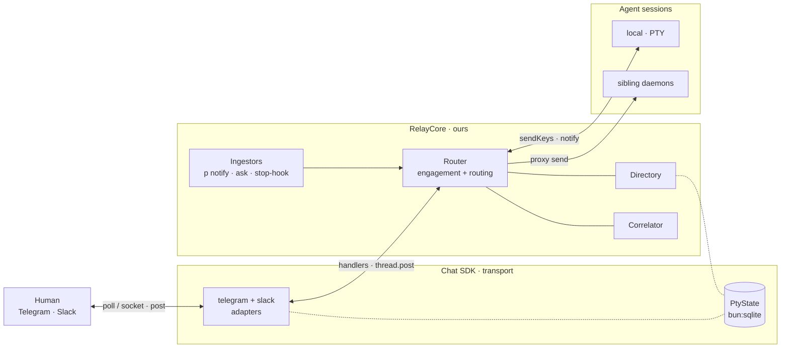
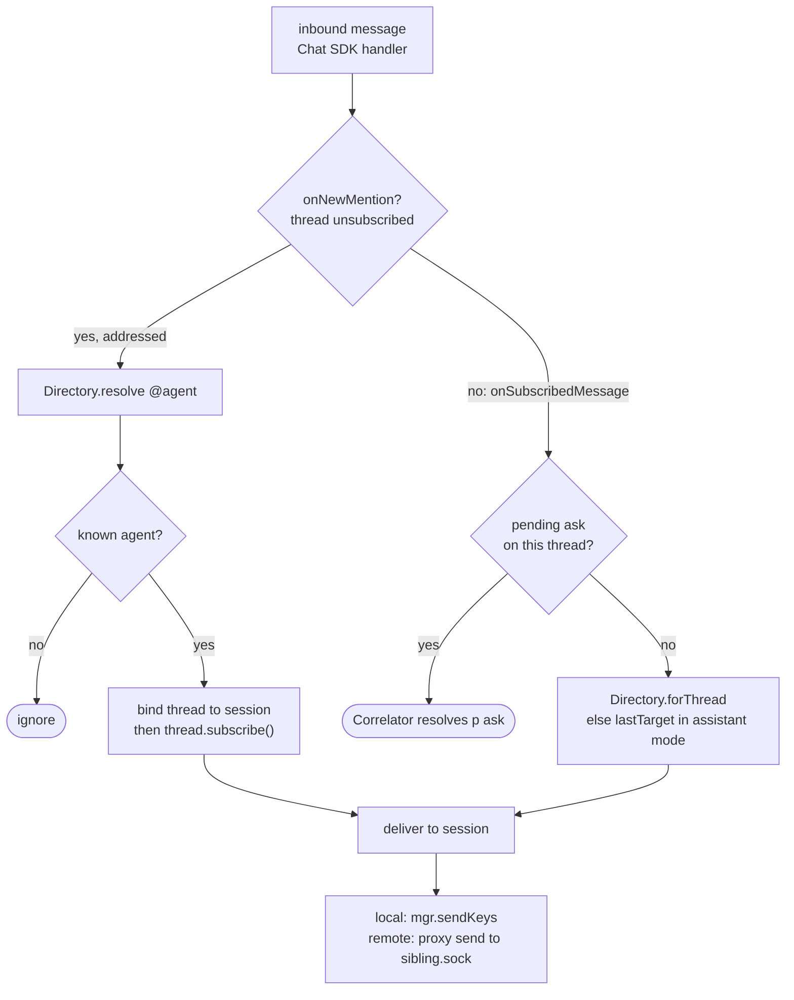
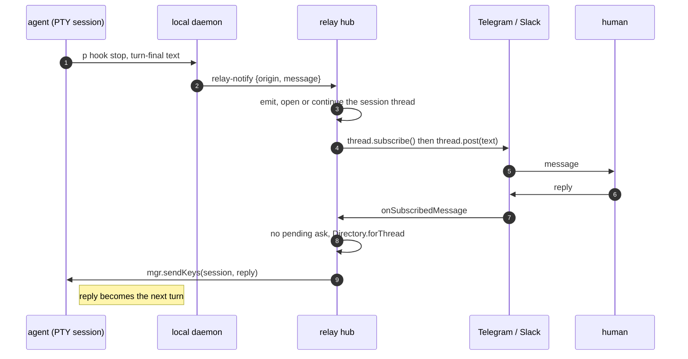
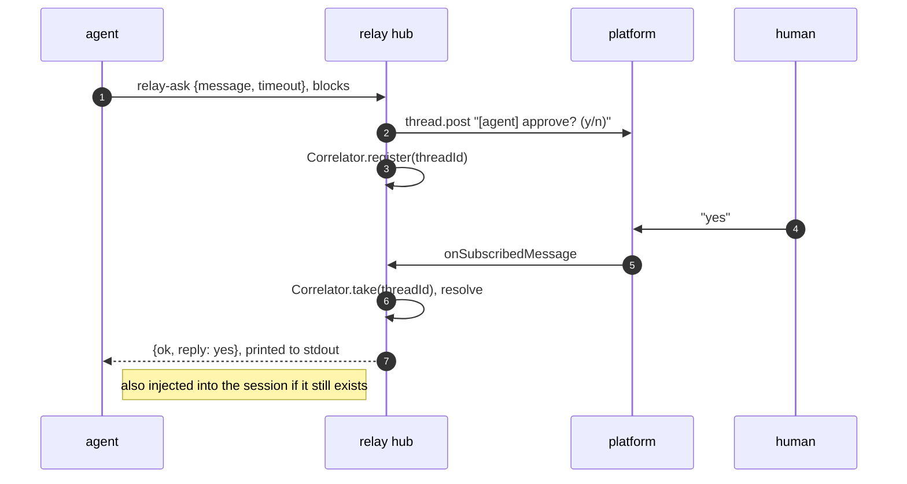
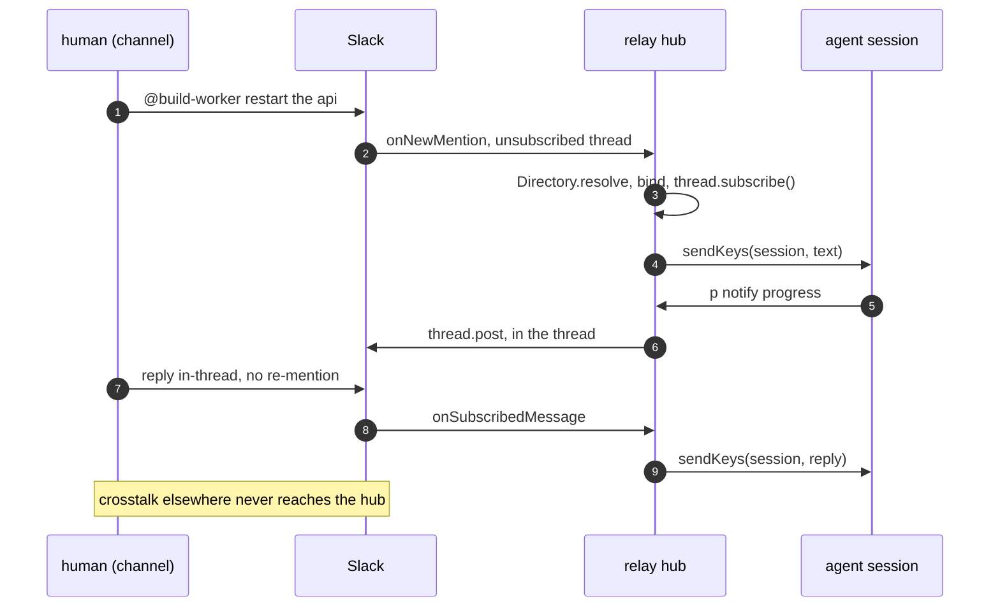
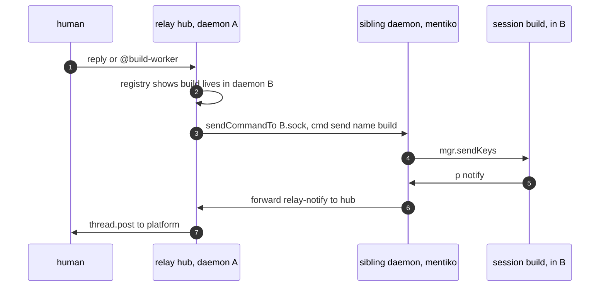

# agent messaging relay — final integration spec

pty-mgr as a **platform-agnostic relay** between agents in PTY sessions and humans
on a chat platform. Decision: **adopt Vercel Chat SDK** (`chat` + `@chat-adapter/*`,
MIT) for transport + platform semantics, and keep a pty-mgr **RelayCore** on top for
the things no framework gives us — PTY reply-injection, cross-daemon routing,
one-hub election, and the assistant/channel engagement policy.

Supersedes [`spec-telegram.md`](./spec-telegram.md). Line refs are into
`lib/pty-manager.mjs` @ v1.4.3.

## vision

Agents do their work in terminals; the people who run them are on their phones.
This relay closes that gap. Any agent in a pty-mgr session should be able to reach
you on the chat app you already live in — Telegram now, Slack, Teams, or WhatsApp
next — and you answer in plain language, the way you'd message a teammate. The
agent never learns a messaging API or even knows the relay exists: it finishes its
turn, and your reply arrives as its next input. The goal is one inbox for every
agent across every daemon, in your pocket — no per-agent wiring, no platform
lock-in, no babysitting a terminal to stay in the loop.

## verified before writing this (evidence, not assumption)

- **Bundle cost is negligible.** `bun build --compile` of `chat` +
  `@chat-adapter/telegram` + `@chat-adapter/slack` (pulls `@slack/web-api`,
  `@slack/socket-mode`, `ws`) → 333 modules, runs, exit 0. Binary **58.4 MB** vs a
  **57.1 MB** empty bun-compile baseline and **57.5 MB** for today's pty-mgr — i.e.
  **+1.3 MB** marginal. The ~57 MB is the embedded Bun runtime we already ship.
- **No public URL needed** for our two targets on a long-running daemon: Telegram
  `mode:"polling"`/`"auto"` (getUpdates) and Slack `mode:"socket"` (Socket Mode).
- **Chat SDK's `StateAdapter` is a superset of what we need** — kv, lists, per-thread
  queues, per-thread locks, and subscriptions (below). We implement it once over
  `bun:sqlite`.
- *Not yet exercised:* a live poll/socket connect (needs real tokens). Verified =
  compile + construct + run.

---

## 1. architecture



**Who owns what**

| concern | owner |
|---|---|
| platform wire protocol, auth, threads, buttons, streaming | **Chat SDK adapter** |
| receive inbound (poll/socket), send outbound (`thread.post`) | **Chat SDK** |
| persistence: subscriptions, kv, queues, locks | **our PtyState** (Chat SDK `StateAdapter` over sqlite) |
| engagement policy (assistant vs channel) | **RelayCore.Router** via subscribe/unsubscribe |
| which session a message drives; PTY injection | **RelayCore + pty-mgr `mgr`** |
| ask⇄reply correlation | **RelayCore.Correlator** |
| cross-daemon delivery, one-hub election | **RelayCore** (+ sqlite locks) |

---

## 2. the load-bearing mapping: engagement modes ↔ Chat SDK subscriptions

Chat SDK already encodes our two modes; we don't build a parallel mechanism.
Confirmed in `chat`'s type docs:

- `onNewMention(thread, message)` fires **only in _unsubscribed_ threads**.
- After `thread.subscribe()`, subsequent messages arrive at
  `onSubscribedMessage(thread, message)` — no re-mention needed. `subscribe()`
  **persists across restarts** (via `StateAdapter.subscribe`).
- The docs' own guidance: *"subscribe when it's a 1:1 conversation, unsubscribe when
  others join so humans can talk."* That is assistant vs channel, verbatim.

So our modes become a **subscription policy**:

| mode | on first contact | engagement trigger | follow-ups | drop rule |
|---|---|---|---|---|
| **assistant** (1:1 DM) | `thread.subscribe()` immediately → bind to the last agent | none needed | `onSubscribedMessage` → route to bound session | never (every msg is for the agent) |
| **channel** (shared room) | do **not** subscribe | `onNewMention` → resolve `@agent`, bind, `thread.subscribe()` | `onSubscribedMessage` → route to bound session | unsubscribed + unaddressed msgs never reach us (Chat SDK only calls `onNewMention`/`onSubscribedMessage`) |

The "within-thread convenience" (address once, then just reply) is *free* — it is
exactly `subscribe()` → `onSubscribedMessage`. The "bare reply → last agent"
assistant convenience is a subscribed DM thread. lastTarget only matters on flat DMs
with >1 agent (below).

Inbound routing, as a decision (channel-mode crosstalk never enters this graph — Chat SDK only calls a handler for subscribed or addressed threads):



---

## 3. data shapes (all of them)

### 3.1 config

Daemon env (only the hub needs ingress creds):

```
RELAY_PROVIDER=telegram,slack           # which adapters to construct
RELAY_BOT_USERNAME=ptybot                # for mention detection
TELEGRAM_BOT_TOKEN=…                      # telegram adapter (auto-detected)
SLACK_APP_TOKEN=xapp-…  SLACK_BOT_TOKEN=xoxb-…   # slack socket mode
```

Per-session, set at spawn or in `pty-mgr.config.json` (not env):

```jsonc
// spawn:  p spawn build zsh --relay-mode channel --agent build-worker
{ "relay": { "mode": "assistant" | "channel", "agent": "<directory name>" } }
```

`relay.mode` default `assistant` (preserves today's DM behavior). `agent` defaults
to the session name.

### 3.2 thread id

Canonical id = Chat SDK's platform-scoped thread id, stored verbatim as the routing
key: `telegram:<chatId>[:<msgThreadId>]`, `slack:<channel>:<threadTs>`. We never
parse it — we map it.

### 3.3 internal events (RelayCore contract)

```ts
// outbound: a session wants to reach a human
interface AgentEvent {
  id: string;                    // correlationId (ULID-ish; caller-supplied)
  kind: "notify" | "ask";
  origin: { daemon: string; session: string; agent: string; cwd: string };
  text: string;
  thread?: string;               // continue a known thread; else Directory opens one
  meta?: { timeoutMs?: number }; // ask only
}

// inbound: normalized from a Chat SDK (thread, message) in the handler shim
interface HumanEvent {
  platform: string;              // "telegram" | "slack"
  threadId: string;
  sender: { id: string; name?: string };
  text: string;
  isMention: boolean;            // message.isMention
  address?: { daemon?: string; session?: string; agent?: string }; // parsed @agent grammar
  replyToThread: boolean;        // arrived as onSubscribedMessage
}
```

### 3.4 Directory records — kv keys in PtyState

```
bind:<threadId>        -> { daemon, session, agent, mode, boundAt }   // thread → session
lastTarget:<convId>    -> { daemon, session }                        // flat-DM convenience
agent:<agentName>      -> { daemon, session, cwd, mode, lastSeen }   // @agent lookup cache
thread4session:<daemon>/<session> -> <threadId>                      // reverse: outbound reuse
```

`convId` = the DM conversation id (platform:chat). Agent lookup is refreshed from the
daemon registry (3.7) so it survives across daemons.

### 3.5 Correlator (in-memory on the hub)

```ts
pendingAsks: Map<threadId, {
  id: string; daemon: string; session: string;
  resolve: (reply: string) => void; timer: Timeout; createdAt: number;
}>
```

Keyed by `threadId`: an `ask` posts into the session's thread; the human's reply
arrives as `onSubscribedMessage` in that same thread → look up by `threadId` →
resolve. (One outstanding ask per thread; N threads = N concurrent asks. Replaces the
single global `tgState.waiter` and its `ALREADY_WAITING`.)

### 3.6 PtyState — Chat SDK `StateAdapter`, backed by `bun:sqlite`

Exact interface we must implement (from `chat/dist`):

```ts
interface StateAdapter {
  connect(): Promise<void>;  disconnect(): Promise<void>;
  get<T>(key): Promise<T|null>;  set<T>(key, value, ttlMs?): Promise<void>;  delete(key): Promise<void>;
  setIfNotExists(key, value, ttlMs?): Promise<boolean>;
  appendToList(key, value, opts?): Promise<void>;  getList<T>(key): Promise<T[]>;
  enqueue(threadId, entry, maxSize): Promise<number>;  dequeue(threadId): Promise<QueueEntry|null>;  queueDepth(threadId): Promise<number>;
  acquireLock(threadId, ttlMs): Promise<Lock|null>;  extendLock(lock, ttlMs): Promise<boolean>;  releaseLock(lock): Promise<void>;  forceReleaseLock(threadId): Promise<void>;
  subscribe(threadId): Promise<void>;  unsubscribe(threadId): Promise<void>;  isSubscribed(threadId): Promise<boolean>;
}
```

Storage — one file `~/.pty-manager/relay/state.db` (`bun:sqlite`, WAL), tables:

```sql
kv     (key TEXT PRIMARY KEY, value TEXT, expires_at INTEGER)         -- get/set/delete/setIfNotExists + Directory records
lists  (key TEXT, seq INTEGER, value TEXT, PRIMARY KEY(key,seq))      -- appendToList/getList
queue  (thread_id TEXT, seq INTEGER, entry TEXT, PRIMARY KEY(thread_id,seq))  -- enqueue/dequeue/queueDepth (FIFO)
locks  (thread_id TEXT PRIMARY KEY, token TEXT, expires_at INTEGER)   -- acquireLock/extend/release (atomic via txn)
subs   (thread_id TEXT PRIMARY KEY)                                   -- subscribe/unsubscribe/isSubscribed
```

Atomicity comes from sqlite transactions; `setIfNotExists`/`acquireLock` are
`INSERT … ON CONFLICT` guarded. Because all daemons share this one file, its locks
double as the **hub election** primitive (3.8). No new dependency — `bun:sqlite` is
built in and compiles into the binary.

### 3.7 daemon registry file — `~/.pty-manager/<daemon>.json`

Written on boot and on session change; read by the hub to enumerate `/list all` and
resolve `@agent` across daemons.

```jsonc
{
  "name": "mentiko",
  "socket": "/Users/…/.pty-manager/mentiko.sock",
  "pid": 44281,
  "startedAt": 1721260000000,
  "isRelayHub": false,
  "sessions": [
    { "name": "build", "agent": "build-worker", "cwd": "/…/app", "alive": true, "relayMode": "channel" }
  ],
  "lastSeen": 1721260530000     // heartbeat mtime
}
```

### 3.8 hub lease — kv row (not a separate file)

```
kv["relay:hub"] = { daemon, pid, provider, acquiredAt }   via setIfNotExists + ttl heartbeat
```

The daemon that wins `setIfNotExists("relay:hub", …, ttl)` constructs `Chat` and calls
`bot.initialize()`. It refreshes the ttl on a timer; if it dies, the row expires and
another relay-capable daemon takes over. Cleanup deletes the row.

### 3.9 socket protocol additions (`handleCommand`)

```jsonc
{ "cmd": "relay-notify", "args": { "origin": {…}, "message": "…" } }
   -> { "ok": true } | { "ok": false, "error": "…" }
{ "cmd": "relay-ask",    "args": { "origin": {…}, "message": "…", "timeoutMs": 120000 } }
   -> { "ok": true, "reply": "yes" } | { "ok": false, "error": "TIMEOUT" | "NO_HUB" }
```

Non-hub daemons forward these to the hub's socket; the hub handles them against
`Chat`. **Reply injection reuses the existing `send` command** — the hub does
`sendCommandTo(<sibling>.sock, { cmd: "send", name, args:{ text } })`, or local
`mgr.sendKeys` — so no new inbound command is needed. `tg-send`/`tg-wait` are kept as
thin aliases of `relay-notify`/`relay-ask` for back-compat.

---

## 4. wiring (hub daemon boot)

```ts
import { Chat } from "chat";
import { createTelegramAdapter } from "@chat-adapter/telegram";
import { createSlackAdapter } from "@chat-adapter/slack";
import { createPtyState } from "./relay/pty-state.mjs";      // our StateAdapter
import { RelayCore } from "./relay/core.mjs";                // our Router/Directory/Correlator

const bot = new Chat({
  userName: process.env.RELAY_BOT_USERNAME ?? "ptybot",
  adapters: {
    ...(process.env.TELEGRAM_BOT_TOKEN ? { telegram: createTelegramAdapter({ mode: "auto" }) } : {}),
    ...(process.env.SLACK_APP_TOKEN    ? { slack:    createSlackAdapter({ mode: "socket" }) } : {}),
  },
  state: createPtyState(),                                    // bun:sqlite @ ~/.pty-manager/relay
});
const relay = new RelayCore(bot, mgr, { daemon: DAEMON_NAME, proxy: sendCommandTo, registry });

bot.onNewMention(       (t, m) => relay.onMention(t, m));     // channel engage
bot.onSubscribedMessage((t, m) => relay.onSubscribed(t, m)); // routed follow-ups + subscribed DMs
bot.onSlashCommand(     (c)    => relay.onCommand(c));        // /list /cap /send …
bot.onAction(           (a)    => relay.onAction(a));         // button clicks (y/n gates)

if (await claimHub()) await bot.initialize();                // only the elected hub polls/sockets
```

RelayCore method sketch:

```ts
onMention(thread, msg) {                 // channel mode engagement
  const target = directory.resolve(parseAddress(msg) ?? { thread: thread.id });
  if (!target) return;                   // addressed nobody we know → ignore
  directory.bind(thread.id, target); await thread.subscribe();
  deliver(target, msg.text);
}
onSubscribed(thread, msg) {              // both modes, follow-ups
  const ask = correlator.take(thread.id);
  if (ask) return ask.resolve(msg.text); // this reply answers a p ask
  const target = directory.forThread(thread.id) ?? directory.lastTarget(thread.convId);
  if (target) deliver(target, msg.text);
}
deliver(target, text) {                  // PTY injection, local or proxied
  target.daemon === DAEMON_NAME
    ? mgr.sendKeys(target.session, text + "\r")
    : proxy(socketOf(target.daemon), { cmd: "send", name: target.session, args: { text } });
  directory.touchLastTarget(target);
}
async emit(ev) {                         // outbound: p notify / p ask / stop-hook
  const threadId = directory.thread4session(ev.origin) ?? await openThread(ev);
  const thread = bot.thread(threadId);
  if (ev.kind === "ask") {
    const p = correlator.register(threadId, ev, ev.meta?.timeoutMs ?? 60000);
    await thread.post(`[${ev.origin.agent}] ${ev.text}`);
    return p;                            // resolves with the reply, or TIMEOUT
  }
  await thread.post(ev.text);
}
```

---

## 5. end-to-end flows

**A. assistant mode, stop-hook** — the agent never knows the relay exists.



**B. assistant mode, blocking gate** — `p ask` blocks until you reply, then prints it.



**C. channel mode, summon then work then reply** — engage on `@mention`, follow-ups in-thread; crosstalk ignored.



**D. cross-daemon** — one bot drives a session that lives in another daemon.



---

## 6. daemon lifecycle changes

- **boot:** write registry file (3.7); construct `Chat` + handlers; `claimHub()` via
  `setIfNotExists("relay:hub")`; hub calls `bot.initialize()`, starts heartbeat.
- **session change:** update registry file + `agent:<name>` kv.
- **cleanup (`1097`, `p stop`):** if hub, `bot`-teardown + delete `relay:hub`;
  delete registry file; `mgr.destroyAll()`; unlink socket. A successor claims the hub
  on its next heartbeat tick.

## 7. ingestion — CLI + stop-hook

- **`p notify "…"`** → `relay-notify` (kind notify). **`p ask "…" [--timeout N]`** →
  `relay-ask` (kind ask, blocks, prints reply). Both tag `origin` from
  `PTY_MGR_SESSION` + `DAEMON_NAME` + cwd. `tg`/`tg --reply` kept as aliases.
- **`p hook stop`** → reads the agent CLI's Stop-hook JSON on stdin, extracts the
  turn-final assistant text + `PTY_MGR_SESSION`, posts `relay-notify`. One small
  **agent-side adapter** per CLI (Claude Code, Codex, Cursor expose the final message
  differently). **Relay trigger** (avoid spamming every turn): config
  `relay.stopHook = off | onQuestion | marker | always`, default `onQuestion`
  (+`@human` marker). Channel mode defaults stricter (explicit `notify`/`ask` only).

---

## 8. what's reused from today

`mgr.sendKeys` (injection), the JSON socket server + `sendCommandTo` (`1478`), the
`~/.pty-manager/*.sock` enumerator `stop all` uses (`~1482`) → registry, `buildSafeEnv`
+ `PTY_MGR_SESSION` (`1030`,`3033`), the chat-id gate (`1064`) → adapter `authorize`,
message chunking (`932`) → adapter `maxLen`. The Telegram poller/`tgState`/`tg-send`/
`tg-wait` are **replaced** by the Chat SDK telegram adapter + RelayCore.

## 9. open decisions (what's left)

- stop-hook relay trigger default (§7) — `onQuestion` vs `marker` vs `always`.
- one-shot `--print` agents: no idle prompt to inject into — require interactive
  sessions, or respawn/resume with the reply?
- `@agent` grammar for flat platforms: `@daemon/session` vs `@agent` (Directory must
  keep agent names unique across daemons; collision policy?).
- hub scope: any relay-capable daemon races for `relay:hub` (current design) vs a
  dedicated `p daemon @relay`.
- Telegram in `mode:"auto"` vs pinned `"polling"` — auto is convenient but flips to
  webhook if a webhook is ever set on the bot; pin `"polling"` for a laptop hub.
- adapters are **beta** — pin exact versions; add a smoke test that boots the hub
  against a throwaway bot before shipping.

## 10. phased build

1. **PtyState** over `bun:sqlite` (implements `StateAdapter`) + unit tests against
   the 18 methods. No platform yet.
2. **RelayCore** (Directory/Router/Correlator) + `relay-notify`/`relay-ask` socket
   cmds + `p notify`/`p ask`, wired to the **Telegram** adapter, assistant mode only.
   Parity with today's `tg`, minus the hand-rolled poller.
3. **Hub election + cross-daemon proxy** (registry + `relay:hub`). `/list all`,
   `@agent` addressing, reply injection into siblings.
4. **Channel mode** (subscribe-on-mention) + **stop-hook** ingestion.
5. **Slack** adapter (socket mode) — validates the abstraction on a second platform.
6. Teams/WhatsApp only when a public ingress + cloud app registration is on the table
   (see prior research: those transports require it regardless of framework).
